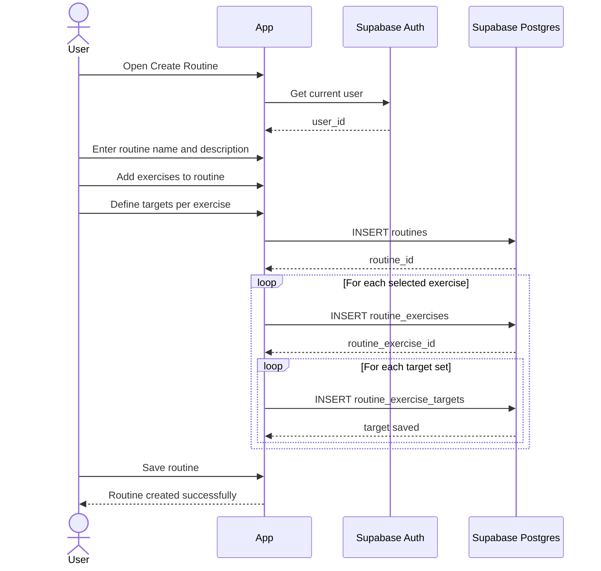

# Create Routine Sequence

This sequence describes how the app creates a reusable routine template with
ordered exercises and target sets.

## Flow

## Notes

- Save the parent `routines` row before inserting ordered routine exercises.
- Persist target sets in `routine_exercise_targets`; workout history should use
  `workout_sets` instead.
- Keep route screens focused on composition and place reusable routine creation
  logic outside `src/app`.
