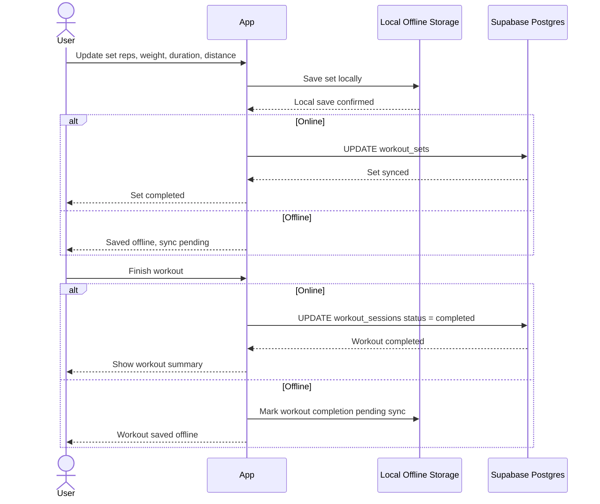

# Log Workout Progress Sequence

This sequence describes how set updates are saved during an active workout,
including the offline-first path.

## Flow

## Notes

- Write local progress first so workout logging remains responsive in poor gym
  connectivity.
- Treat synced remote updates as confirmation, not the source of immediate UI
  feedback.
- Queue offline completion separately from set updates so the workout can close
  cleanly when the network returns.
