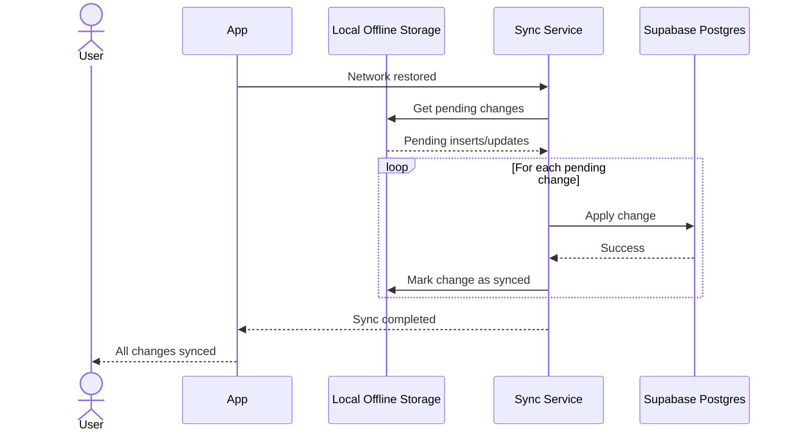

# Offline Sync Sequence

This sequence describes how locally queued workout changes are pushed to
Supabase after connectivity is restored.

## Flow

## Notes

- Store enough metadata with each pending change to replay inserts and updates
  deterministically.
- Mark a change as synced only after Supabase confirms the write.
- Surface sync completion in the progress area without blocking workout logging.
