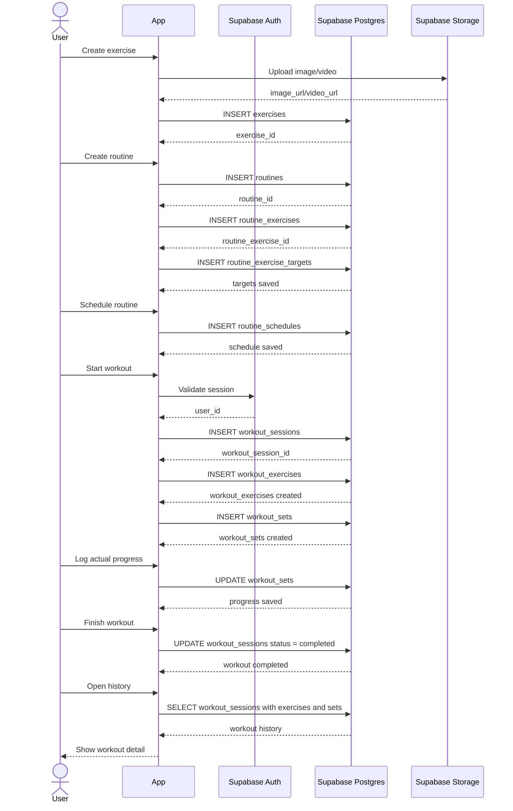

# Routine Workout History Sequence

This end-to-end sequence shows how a user-created exercise and routine become a
completed workout that can later be viewed in history.

## Flow

## Notes

- Use routine tables as templates and workout tables as history records for a
  specific session.
- Copy exercises and planned sets into the workout session at start time so later
  routine edits do not rewrite past workout history.
- Fetch history from `workout_sessions` with nested exercises and sets for a
  single detail view.
