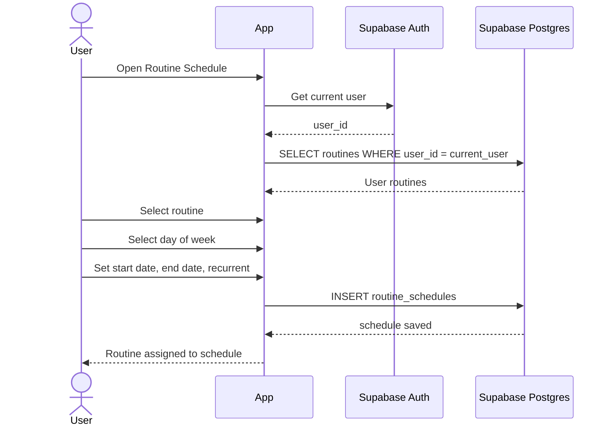

# Schedule Routine Sequence

This sequence describes assigning an existing routine to a day or recurring
schedule.

## Flow

## Notes

- Only show routines owned by the authenticated user.
- Define one `day_of_week` convention across the app and database.
- Keep inactive or expired schedules available for history instead of deleting
  them by default.
