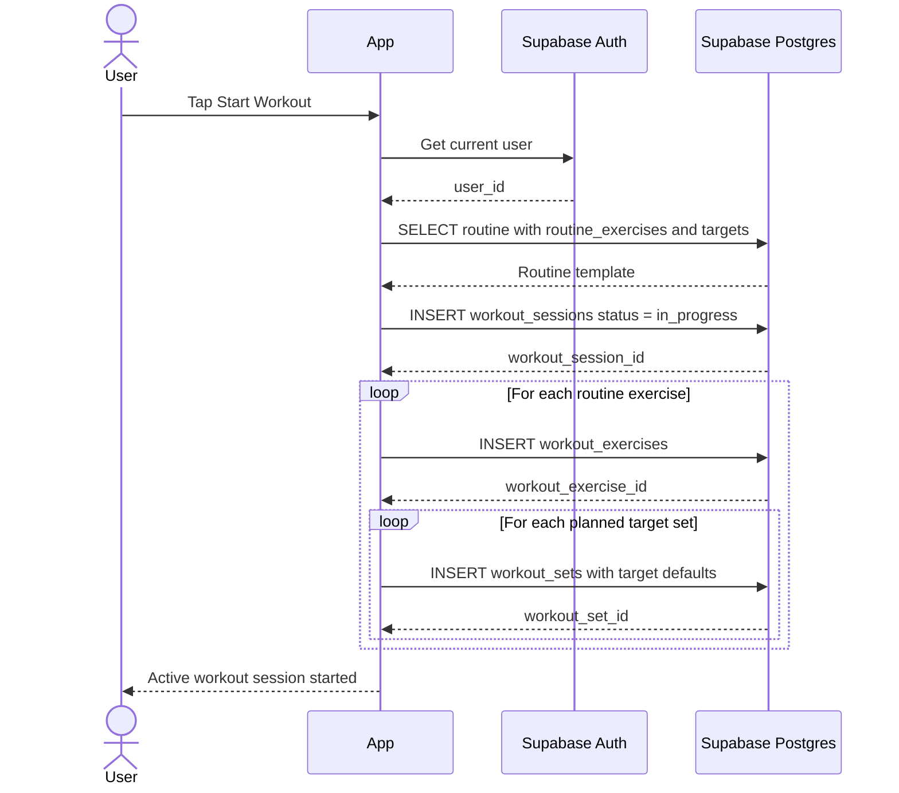

# Start Workout From Routine Sequence

This sequence describes how a routine template is materialized into an active
workout session.

## Flow

## Notes

- Create one `workout_sessions` row per started workout.
- Copy the routine exercise order into `workout_exercises`.
- Seed `workout_sets` from routine targets so users can adjust actual values
  during the session.
