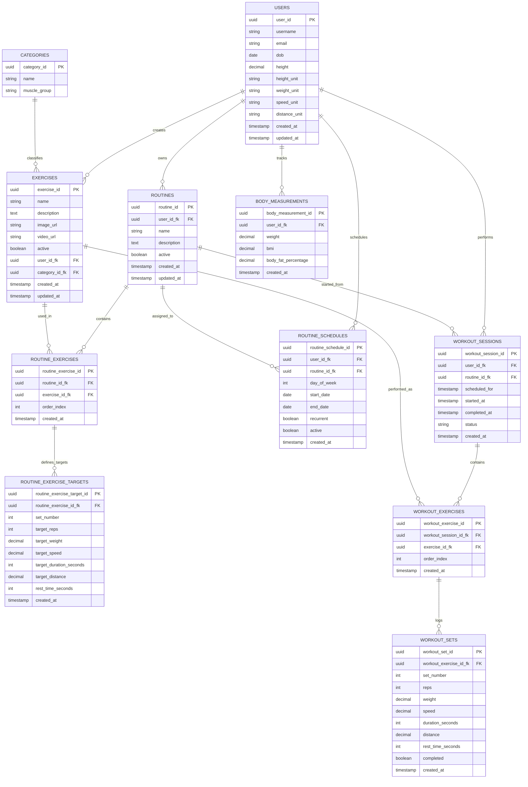

# Database Table Design

This document describes the core CalFit data model for users, exercise catalogs,
routines, scheduled workouts, workout logging, and body measurements.

## Entity Relationship Diagram

## Table Notes

| Table | Purpose |
| --- | --- |
| `USERS` | Stores account identity, physical profile basics, and preferred measurement units. |
| `CATEGORIES` | Groups exercises by category and muscle group. |
| `EXERCISES` | Stores built-in or user-created exercises with optional media and category links. |
| `ROUTINES` | Stores reusable workout plans owned by a user. |
| `ROUTINE_EXERCISES` | Orders exercises inside a routine. |
| `ROUTINE_EXERCISE_TARGETS` | Stores planned set targets for each routine exercise. |
| `ROUTINE_SCHEDULES` | Assigns routines to calendar days or recurring schedule rules. |
| `WORKOUT_SESSIONS` | Tracks a scheduled, active, completed, or skipped workout instance. |
| `WORKOUT_EXERCISES` | Copies the ordered exercise list into a workout session. |
| `WORKOUT_SETS` | Logs actual set performance during a workout. |
| `BODY_MEASUREMENTS` | Records body metrics over time for progress tracking. |

## Implementation Notes

- Keep unit preferences on `USERS`; store numeric measurement values without unit suffixes.
- Use `ROUTINE_EXERCISE_TARGETS` for planned work and `WORKOUT_SETS` for actual logged work.
- Define a single convention for `ROUTINE_SCHEDULES.day_of_week` before implementation, such as `0` for Sunday through `6` for Saturday.
- Treat `WORKOUT_SESSIONS.status` as an enum in application code, for example `scheduled`, `in_progress`, `completed`, or `skipped`.
- If the app supports global exercises, allow `EXERCISES.user_id_fk` to be nullable; otherwise require every exercise to belong to a user.
